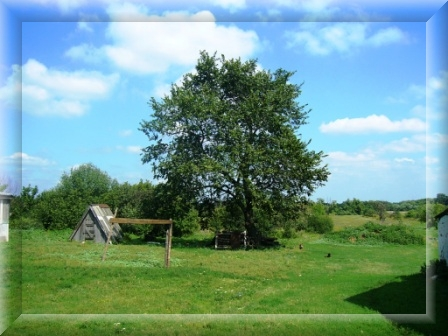

# Тихая моя родина

(с.Сосновка Мордовского района Тамбовской области)

Где-то в сердце России, в продуваемых насквозь тамбовских степях стоит маленькая деревня Сосновка. Такая, из которых состоит Россия. Ничем не примечательная, никем не знаменитая.

И от этого, не менее любимая.

В заветных ладанках не носим на груди,  
О ней стихи навзрыд не сочиняем,  
Наш горький сон она не бередит,  
Не кажется обетованным раем.  
Не делаем ее в душе своей  
Предметом купли и продажи,  
Хворая, бедствуя, немотствуя на ней,  
О ней не вспоминаем даже.  
Да, для нас это грязь на калошах,  
Да, для нас это хруст на зубах.  
И мы мелем, и месим, и крошим  
Тот ни в чем не замешанный прах.  
Но ложимся в нее и становимся ею,  
Оттого и зовем так свободно — своею..

А.Ахматова

## Немного об истории моего села

Книга об исследовании родословной, истории села Изосимово, однодворцах Тамбовского края, а также о жизни и карьере Александра Христофоровича Бенкендорфа.

[***С чего все начиналось***](chapters/01-s-chego-vsyo-nachinalos.md)

[***Однодворцы***](chapters/02-odnodvorcy.md)

[***Землевладельцы***](chapters/03-zemlevladelcy.md)

[***Дворяне***](chapters/04-dvoryane.md)

[***Александровка***](chapters/05-aleksandrovka.md)

[***Ссылки***](chapters/ref.md)