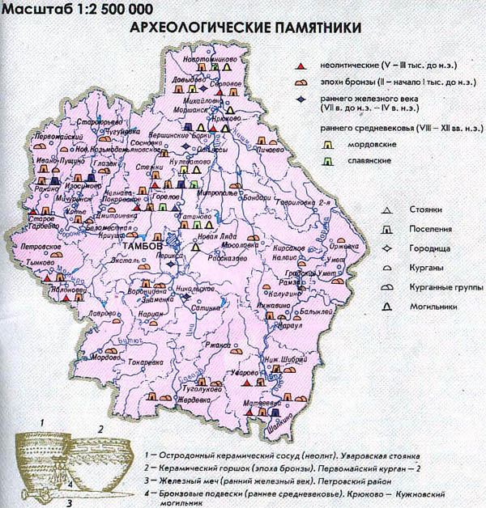
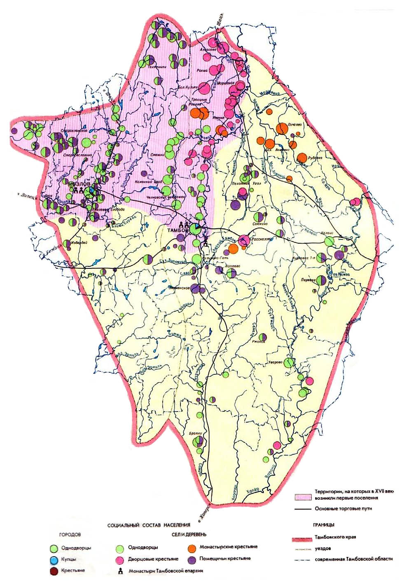

# Глава 1: С чего всё начиналось

Принимаясь исследовать свою родословную, я рассчитывала, что найду примерно такую информацию: «С. Изосимово (Мичуринский р-н). Из подворной записи писцовой книги видно, что село Изосимово основано в 1636-1637 гг. после того, как Козловский воевода Иван Биркин указал каждому будущему жителю размер усадьбы, количество земли, сенокосных и лесных угодий.

В 1651-1652 гг. князь Данила Несвитский занес в писцовую книгу следующие сведения о селе Изосимово: «Село Изосимово, на реке, на Лесном Воронеже, а в нем церковь, строения мирского... и всего в селе Изосимове сорок шесть дворов помещиковых, а людей в них 130 человек»[^1].

Однако, освоение южных просторов Тамбовщины задержалось лет на сто - сто пятьдесят в соответствии с темпами продвижения Российского государства и найти документа об основании моего села оказалось делом очень долгим и почти безнадежным.

Итак, жизнь в моих родных местах была всегда. Курганы и поселения эпохи бронзы (III – I тысячелетие до н.э.) обнаружены в Александровке, Воронцовке, Знаменке, Кариане. Сохранились и следы пребывания иранских (скифы, сарматы) и тюркских (гунны, авары, болгары, кочевники – печенеги и половцы) племен. Под их напором восточно-русское племя вятичей в ХI веке вынуждено было покинуть подонье и выселиться на Оку. Следами этих событий служат половецкие курганы – памятники погибшим в боях с рязанским княжеством.

Над некоторыми из них возвышались грубые каменные изваяния женщин, по мнению Черменского, неких сакральных символов половцев. Одна из таких статуй была найдена в мае 1882 года в одной версте от реки Битюг и в двух верстах от с. Политова Мельгуновской волости: «Каменная баба из двух камней, вышиной 115 см и шириной в 40 см. На одном камне высечено рельефом поясное женское изображение... Плугари при распашке пара задели в середине кургана за камень с изображением фигуры человека, который был в земле в стоячем положении, под ним оказался другой камень в виде подставки... До переселения крестьян в село Политово, в этой местности была степь, а на месте, где найден камень, был большой бугор, который в продолжении более 60 лет, в следствии распашки земли, постепенно уменьшался»[^2]

Немного северо-восточнее Сосновки, в Знаменском районе Археологи обнаружили остатки русского города домонгольского периода. В ходе тщательных изысканий в кургане раскопаны пять христианских захоронений (погребены двое мужчин, два ребенка и женщина). В могилах найдены многочисленные предметы, благодаря которым находка может быть отнесена к русской культуре XIII века. Это столовые и обрядовые ножи, серьги, обереги, наконечники стрел. Ученые уверены, что раскопанный город - первый из русских городов, вставший на пути хана Батыя в 1237 году.

В историческое время древнейшими обитателями Центрального Черноземья были славяне. В 6 веке нашей эры они были известны под именем антов. Славянские племена, расселившиеся в верховьях Дона и Оки, по Сейму, вели оседлый образ жизни, занимались земледелием. Однако в пределы южнорусских степей попеременно вторгались пришлые центрально-азиатские народы – хазары, печенеги, половцы, которые нередко вынуждали земледельцев-славян оставлять обжитые места и уходить на север, за Оку.

В особенно тяжелом положении оказалось население Черноземного Центра в 13-15 веках, когда Русь попала под власть татаро-монголов. В 15 веке Московская Русь начинает организовывать на южной границе своих земель отпор захватчикам. Татаро-монголы, не желая мириться с военно-оборонительными мероприятиями Москвы, выжигают все поселения славян Черноземья, а население, не успевшее спастись бегством на север, уничтожают или обращают в рабство и отправляют во внутренние районы Золотой Орды. К концу 15 века территория Черноземного Центра оказалась безлюдной. Она превратилась в «Дикое поле». В начале ХVI века территория среднего и нижнего Поволжья, в том числе и территория Тамбовского края, была присоединена к русскому государству.

Освобождение Московской Руси от господства татар открыло широкие возможности для хозяйственного освоения Черноземного края. В 16-17 веках происходит интенсивное заселение Придонья, освоение «Дикого поля».

Переселенцев из рязанских и заокских земель манили сюда плодородные земли, широкие степные просторы, зеленые дубравы, сочные луга живописных лесных долин. Особенно мощный поток беглецов устремился на Юго-восток, к Битюгу. Заселение реки началось с 1613 года, когда правительство молодого царя Михаила Федоровича Романова старалось разными способами пополнить государственную казну, разоренную в "смутное" время. Один из способов заключался в сдаче "на откуп" от имени государства обширных незаселенных территорий на юге страны. Отдельные участки в виде "ухотьев" или "ухожаев" (употреблялось и тюркское слово "юрт") сдавались в аренду на год или на несколько лет для рыбной ловли, охоты на пушных зверей, сбора меда диких пчел. 

Во время составления "Дозорной книги 1615 года" территория ухотьев превышала заселенную часть Воронежского уезда в 8 раз. Арендаторы не устраивали постоянных поселений в своих ухотьях из-за опасности нападения крымских татар или ногайских. Они бывали там наездами обычно. 

"Дозорная книга" называет 17 больших воронежских ухотьев. Одним из них был Битюцкий с малыми притоками. В 1615 году его арендовали беломестный атаман Кирей Леонтьевич Подзоровка и сын боярский Иван Андреевич Немой. За ухотей они платили в казну 30 рублей в год. С 1623 года Битюцкий ухотей был в "откупе" у крепостного крестьянина Григория Побежимова (владельцем крестьянина являлся известный боярин Иван Никитич Романов — родной дядя царя Михаила Федоровича). В 1641 году реку Битюг арендовал "Воронежа города иноземец" Савелий Хомицкий, в 1646 — "пушкарь, торговый человек" Клим Морковкин. Арендная плата за Битюг быстро росла. Пушкарь Морковкин платил уже 161 рубль в год. После строительства Белгородской черты арендатором богатых земель выступил Козловский Троицкий мужской монастырь.

В 1685 году битюцкие земли описала военно-топографическая экспедиция под руководством дворянина Ивана Жолобова. Документ дает основание сделать ясный и однозначный вывод: ни одного постоянного поселения на Битюге тогда еще не было... 

Коренным образом военно-политическая ситуация в крае изменилась в результате Азовских походов Петра I и особенно летом 1696 года, после взятия у турок Азова и прочного выдвижения русских войск в Приазовье. Опасность появления грабительских татарских отрядов у Битюга уменьшилась, и смелые русские люди устремились на плодородные земли. 

1 марта 1697 года Битюг был отдан Острогорскому полковнику Петру Буларту за 202 рубля в год. При этом полковник получил разрешение поселить "беспошлинных черкас" (украинцев). По призыву Буларта к Битюгу пришло 800 семей черкас из-под Полтавы и других земель левобережной Украины. Весной 1698 года к реке устремились новые группы переселенцев. Начальник Разрядного приказа, один из ближайших соратников Петра I боярин Тихон Никитич Стрешнев летом того же года пришел разобраться с положением дел на Битюге. Воеводе города Старый Оскол стольнику Ивану Тевяшову было дано задание от имени Петра: поехать на Битюг, переписать там новых жителей и "доправить" на них деньги, которые казна рассчитывала получить. Тевяшов начал описание с низовьев реки (то есть с территории Воронежской области) и описал 14 новых поселений.

1 сентября 1698 года Тевяшов послал донесение в Москву из Битюцкой слободы: "Вверх по реке по обе стороны... живут поселением слободами и деревнями русские и черкасы многие люди. Новые жители владеют различными угодьями — и пашню пашут, и сено косят, и хоромный и дровяной лес рубят, и мельницы и займища занимают..." Упоминал он и селения в Чамлыкском, Вязковском юртах, которые пока не имели самостоятельных названий.

23 апреля 1699 года в Воронеже Петр I подписал именной указ, по которому русских людей и черкас, поселившихся у реки Битюг, надлежало сослать на прежние места их проживания, "а строенья все пожечь и впредь им селиться на Битюге не разрешать". Проект царского указа был подготовлен дьяком Никитой Поярковым. На Битюг послали карательный отряд, который действовал осенью 1699 года в соответствии с царским указом. В архивах сохранилась запись от 16 декабря: "Те битюцкие жители с тех угодий сосланы, и дворовое строенье пожжено". Тут же указано: сожжено 1515 дворов...

В ноябре 1699 года Петр I издал новый указ. По нему на Битюг надлежало переселить дворцовых крестьян центральных и северных уездов России (сначала — из Пошехонского, затем — из Ярославского, Костромского, Ростовского и других). Переселение началось в 1701 году. Оно привело к гибели тысяч мужчин, женщин, детей, не выдержавших трудностей далекого пути, не приспособленных к совершенно новым для них климатическим и природным условиям. Но вскоре переселенцы оценили достоинство здешних мест. Началась новая колонизация нашего края.

Рис. Заселение Тамбовского края

---

[→ Глава 2: Однодворцы](02-odnodvorcy.md)

---

## Сноски

[^1]: Н. В. МУРАВЬЕВ. ИЗБРАННЫЕ КРАЕВЕДЧЕСКИЕ ТРУДЫ
[^2]: Тамбовские губернские ведомости, 1884, № 84.

