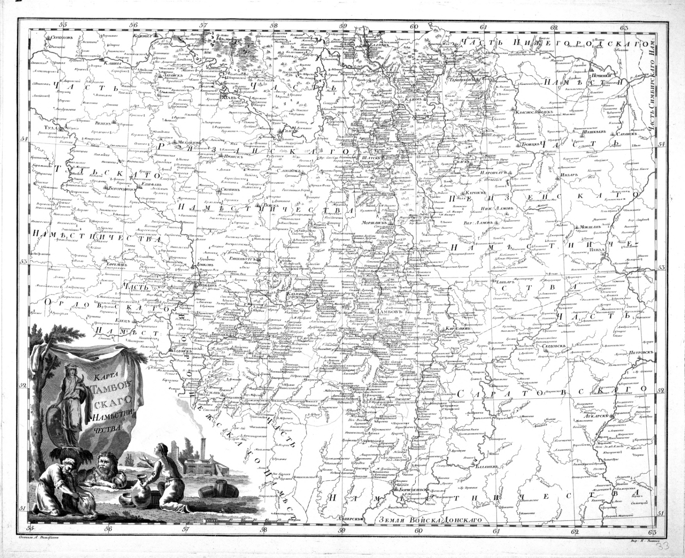

# Глава 2: Однодворцы

Русскими колонизаторами этих земель были, в основном, однодворцы. Так называли выходцев из мелкого служилого люда, не имевших крепостных крестьян и живших «одним двором». Первоначально они являли собой пограничную службу. В Тамбовской провинции по 1-й ревизии (1719 г.) из 166 тыс. ревизских душ однодворцы составляли 55%, в 1779 – 22,5% из 356,7 тыс. человек населения.

Зажиточные однодворцы иногда нанимали себе работников и жили с ними "одним двором". Коренными жителями края считались служилые люди, помещенные в опустевшем пограничье в XV-XVII веках для охраны путей, ведущих с юга к Москве. Это - казаки, стрельцы, пушкари, засечные сторожа и другие, кто послан, перемещен из тульских, калужских, рязанских и прочих уездов. "Дети боярские" считались привилегированным разрядом воинов. Их верстали, как тогда говорилось, "по отечеству", "испомещали на земле", то есть давали надел, который сохранялся за ними в нескольких поколениях, но иногда - лишь до окончания службы. Отсюда и название - помещики, которое позднее осталось только за дворянами-вотчинниками.

В число однодворцев попали и обедневшие потомки старинных дворянских родов (при Петре I некоторые из них записывались в однодворцы, чтобы избежать обязательной службы), имевшие дворянские грамоты. 5 мая 1801 им было предоставлено право отыскивать и доказывать потерянное их предками дворянское достоинство. Но уже через 3 года повелено было рассматривать их доказательства "со всею строгостью", наблюдая при этом, чтобы в дворянство не были допущены люди, утратившие его "за вины и отбывательство от службы".

Земля, полученная в поместье, путем испомещения служивых людей, называлась четвертной, а право владеть этой землей называлось четвертным правом. «Приоброченную» землю нельзя было продавать, ее можно было уступать только ближайшему родству. Поэтому настоящие, многоземельные однодворческие деревни, в которых жили потомки дворян и детей боярских, обычно знали свои родословные, помнили не только кто от какого деда происходит, но и знали, кто с кем и в какой степени состоит в родстве. Как писал Н.А. Благовещенский, «эти воспоминания с точностью хранятся лишь детьми боярскими, никогда не забывавшими про свою родовитость и прежнюю службу дедов своих, в сборных же селениях не бывает преданий». Собственно, это и принималось за «чванство своим происхождением» родовитых однодворцев теми, кто своих предков и не помнили.[^3]

«Позятьевщина», когда «приставший на наследницу» зять-чужеродец входил в четвертную общину, обычно не давала формального четвертного права, и формальными земельными актами не оформлялась. Крепостных крестьян среди них, конечно, не было, поскольку не пойдет свободная однодворка за барского крепостного, а настоящие дворяне-помещики ими пренебрегали, поэтому дворяне-однодворцы много поколений подряд роднились почти исключительно между собой. Н.А. Благовещенский отмечает, что однодворцам было присуще «страшное чванство своим происхождением и высокомерная родовая нетерпимость к низшим сословиям»[^3]. Много поговорок об однодворцах сохранилось до наших дней: «Сам пашет, сам орет, сам и денежки берет (однодворец). Тащил черт однодворцев в коробе, да рассыпал под гору. Нес черт грибы в коробе, да рассыпал по бору: и выросли однодворцы! Собрал черт всех однодворцев в решето, и понес: гром грянул, он и выворотил их над Воронежем!» ( В.И. Даль)

Людям, которым предстояло обосноваться и обзавестись прибыльным хозяйством на новом месте, пусть даже с более благоприятными природно-климатическими условиями, но расположенном среди непроходимых лесов или целинных степей, необходимо было обладать особым характером. Однодворцы слыли трудолюбивыми, домовитыми, аккуратными, одевались чисто и не без форса. Двор строили укромно, любили высокие плетни.

Крепостной мужик, напротив, строился кое-как, всё у него в хозяйстве было настежь, на обзор прохожему, они более неприхотливы в пище: пироги одного-единственного типа, мясо без затей - кусками, овсяной кисель, редька, полба, а позднее - картошка. Полба - почти забытая теперь пшеница-спельха, иначе - примитивная пшеница. Помните как у Пушкина: "...есть велел варёную полбу..".

Однодворческие женщины, в отличие от крепостных соседок, хорошо готовили. Стол у них, хотя и небогатый, но разнообразный. Садились за пустой стол, покрытый чистой холщовой скатертью, хозяйка тут же выносила блюдо с нарезанным тёплым хлебом-ситником, политым коровьим маслом. Память о "поклонении хлебу". А хозяин - обносил гостей. Пили из одной чарки. Следующая перемена - холодец, залитый домашним квасом, на манер окрошки. А уж потом ставили другие закуски, смотря по зажиточности. Но обязательными были жирная лапша и молочная каша на десерт. Индейки и гуси разводились главным образом однодворцами, а уж потом распространились в другие деревни.

Позднее, в XVIII в. в степи после ее «замирения» происходило вторичное заселение земель крестьянами, беглыми и теми, кто был переселен помещиками из других губерний. Первые и более поздние переселенцы долго различались, особенно в одежде: крестьянки из коренных жителей носили поневу и «рогатую» кичку, однодворки – костюм с сарафаном (либо полосатой юбкой) и кокошники.

Выговор однодворцев в наших деревнях был подчеркнуто "акающий", из группы рязанских наречий, с характерным "якающим" окончанием, кагоканьем и мягким окончанием глаголов (-ть). В XIX в. отдельные группы однодворцев были известны под прозвищами: «галманы» (иронич. – бранные, бестолковые); «йонки» (от йон – он), «индюки» (гордые), «талагаи» (бездельники, невежи), «щекуны» (грубого нрава, говорившие «що» вместо «что»). Подобные прозвища давались не только однодворцам, но и крестьянам по особенностям говора, как, например, «цуканам». В языке «цуканов» звучало «ц» вместо «ч». По особенностям языка получили прозвище «ягуны» и «кагуны» (кагокающий говор) –воронежские и тамбовские крестьяне. 

Между тем, со времени первой ревизии в отношении однодворцев произошло важное новшество – по распоряжению правительства в 1724 году причислены к государственным крестьянам. Государственные крестьяне – потому, что платят налоги в государственную казну. Именно поэтому их еще называли казенными крестьянами. В.И. Даль в своем «Толковом словаре» приводит старую поговорку – «Казенный крестьянин живет, как бог велит, а барский, как барин рассудит». 
Именно однодворцами были основаны первые поселения в наших местах. На первом атласе Российской губернии, изданном Ильиным в 1745 году, поселений в наших местах не обозначено. 

Первые населенные пункты исследованы и нанесены на карту в 1792 году русским картографом Александром Вильбрехтом после образования Тамбовской губернии. 

Самыми ранними документами в Тамбовском архиве о населенных пунктах на реке Пласкуше, пожалуй, является межевая книга и план деревни Пласкушской (Новосильцевой) бывшей Воронежской губернии, поселенной до запретительного Указа Сената от 27 апреля 1765 года на дикопоросшей земле в занятой для поселения иностранцев окружности, принадлежащей поручику Новосильцеву С.У. 1775 год (574 десятины 2228 саженей)[^5]. Кроме того, важны межевая книга казенной земли, проданной Новосильцеву С.У. 1783 год (843 десятины 203 сажени)[^6], межевая книга казенной земли около хутора Петровского 1783 год (921 десятина 1680 саженей)[^7]. А также межевая книга и план земли, отмежеванной бывшими опекунскими межевщиками на число душ деревни Пласкуши, принадлежащей майору Лихачеву Н.Ф. (прежде однодворцам) 1784 год (535 десятин 1555 саженей)[^8]. Интересны также межевые книги 1784 года части деревни Кариян (Бегичева), принадлежащей подполковнице Бегичевой Н.С.[^9], план земли, отмежеванной опекунскими межевщиками на число душ деревни Малышкиной, принадлежащих секунд-майору Коромыслову Я.А. и однодворцам.[^10]

Следует отметить, что В XVII и XVIII столетиях Тамбовская земля по административному делению была провинцией и подчинялась Воронежскому вице-губернатору. Но в 1779 году было образовано Тамбовское наместничество, которое возглавлял генерал-губернатор граф Р.И. Воронцов, а в 1796 году Тамбовское наместничество было переименовано в губернию.

В 1765 году Екатерина II издает манифест о генеральном межевании, которое положит начало точным определениям земельных владений в России. Манифестом 1765 г. Екатерина отказалась от проверки владельческих прав на землю и руководствовалась принципом оставления за помещиками земель, которыми они владели к 1765 г. Таким образом, все земли, ранее захваченные у казны, однодворцев и соседей, передавались помещикам в безвозмездное пользование.

Только в XVIII в. в руках помещиков оказалось около 50 млн. десятин земли, на владение которой они юридических прав не имели. Манифест 1765 г. положил новый этап межеванию, значительно ускорив его проведение. Несколько ранее, 22 июля 1763 г., был обнародован ещё один манифест Екатерины II, «О дозволении всем иностранцам, в Россию въезжающим, поселяться… и о дарованных им правах», который предлагал иностранцам поселяться во всех губерниях Российской Империи. Переселенцам гарантированы были отправление обрядов по их вере, свобода от платежа податей на определённое число лет, отвод земель в достаточном количестве, свобода от военной службы, невмешательство чиновников во внутреннюю их юрисдикцию. Для этих целей часть казенных, т.е. находившихся в управлении государства земель, резервировалась для поселения иностранцев.

К концу 18 века в нашей округе земли были преимущественно казенные и однодворческие. В ревизских сказках 1782 года деревни Малышкино Березова тож Тамбовской округи находим упоминание о семье однодворцев Антона Яковлева сына Малышкина (3 души мужского пола и 1- женского), Семена Иванова сына Малышкина (2 души мужского пола и 3- женского). Очень неразборчиво дошли до наших дней ревизские сказки деревни Толмачевой однодворца Пимена (?) Тимофея сына Стародубова.[^11]

---

[← Глава 1: С чего всё начиналось](01-s-chego-vsyo-nachinalos.md) | [→ Глава 3: Землевладельцы](03-zemlevladelcy.md)

---

## Сноски

[^3]: Н.А. Благовещенский. ЧЕТВЕРТНОЕ ПРАВО. Типо-Литография Товарищества И.Н. Кушнерев и Ко., Москва, 1899; обработал В.Н.Орлов, 2007.
[^5]: ГАТО, ф.29, оп.2, д.192,193.
[^6]: ГАТО, ф.29, оп.2, д.2165.
[^7]: ГАТО, ф.29, оп.2, д.2229.
[^8]: ГАТО, ф.29, оп.2, д.2746.
[^9]: ГАТО, ф.29, оп.2, д.2704.
[^10]: ГАТО, ф.29, оп.2, д.2725.
[^11]: ГАТО, ф.12, оп.1, д.124.

