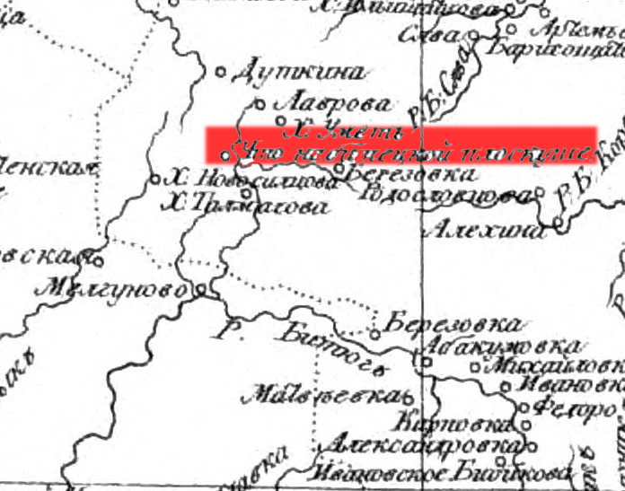

# Глава 3: Землевладельцы

Среди крупных землевладельцев конца 18 века выделялись секунд-майор Лихачев Федул Николаевич и Савва Устинович Новосильцев. В 1775 году 24 июля было признано право подпоручика Новосильцева на 574 десятины 2228 саженей земли по берегу реки Пласкуши только на основании того, что он ее использовал. Никаких документов в юридическое обоснование права владения этой частью земли у него не было. А в 1783 году после кончины подпоручика земля была тщательно разделена между наследниками, но уже землицы той было 843 десятины 203 сажени.

В том межевом деле в качестве свидетелей упоминается большое количество однодворцев, среди которых Леонтий Мамантов, Висхлей Федор, Малышкины, Толмачевы, также сторонние люди Козловского уезда села Толкачева Сурены Юрловской волости, села Маслова Сурена, села Богоявленского, что на Сурене, крепостные вдовы подпоручицы Анны Ивановны Новосильцевой, Ивана Ларионовича Воронцова.[^5] В 19 веке фамилия Новосильцевых в межевых делах уже не встречается, видимо, продали многочисленные наследники свою землю, либо разорились и стали просто крестьянствовать.

12 августа 1784 года было произведено межевание земли на число душ деревни Пласкуши Тамбовского уезда, бывшего владения однодворцев, от которые по купчей отошла секунд-майору Федулу Николаевичу Лихачеву. Как ориентиры указаны владение Новосильцева, проселочная дорога, лежащая из деревни Пласкуша в деревню Малышкину по линии безымянного оврага и речку Пласкуша, проселочная дорога из деревни Пласкуша в деревню Абакумовку. Уездный землемер в качестве свидетелей призвал подпоручика Новосильцева крестьянина Петра Артамонова и сторонних людей Тамбовского уезда разных селений жителей: деревни Ивановки титулярного советника Ивана Самойлова сына (Неразборчиво) крестьяне Иван Афанасьев, Аким Степанов, деревни Абакумовки надворной советницы… Севостьян Губарев, Сидор Губарев, Герасим Борщов, Семен Ушаков, Андрей Нечаев, Федот Черлидинъ, деревни Михайловки однодворцы Семен Филлипов, Антип Истомин.[^8]

Есть предположение, что последней представительницей рода Лихачевых была Анна Петровна Лихачева, вышедшая замуж за одного из Писаревых. В одной из записей метрической книги Покровской церкви за 1848 год упоминается крестьянин деревни Пласкуши госпожи Анны Писаревой (Лихачевой). Присутствие Лихачевых на Тамбовщине прослеживается даже в далеком 1641 году. Офонька Лихачев — один из сторожевых казаков, писавших царю Михаилу Федоровичу о бедственном положении охранников Тамбовской крепости и просивших о повышении жалованья.

Вот как выглядела карта нашей местности в 1792 году: Хутор Новосильцева, Хутор Толмачева (владения Лихачева Ф.Н. еще всю первую половину 19 века будет называться деревня Толмачева Пласкуша тож), Березовка, она же Малышкина и… Подлинная загадка истории. Там, где сейчас стоит современная Сосновка — селение с названием «Что на Битецкой Пласкуше».

Деревня, что на Битецкой Пласкуше или Сосновка, что на Битецкой Пласкуше? Или какое-то другой поселение, к Сосновке отношения не имеющее??? Географические ориентиры, думаю точными не будут, потому как карта Вильбрехта – это лишь вторая попытка составить Российской атлас.

И почему тогда в качестве смежеств в приведенных межевых книгах Сосновка не упоминается? Ответ на этот вопрос мы найдем в большом деле Тамбовской губернской чертежной палаты, которое называется «Дело о проверке количества казенной земли в с. Изосимово Тамбовского уезда, взятой в оброк подпоручицей Лихачевой за декабрь1825 –январь 1839 г.»[^12] В лучших традициях Российского чиновничества почти 14 лет длилось разбирательство в различных инстанциях, козловском, лебедянском и усманском уездных судах , губернском правлении, потребовалось даже обращение к царю, чтобы выяснить, почему на бумаге отданной в казенный оброк земли числиться 1113 десятин 1188 саженей, на них и начисляется арендная плата, а фактически есть только 989 десятин. В материалах этого дела мы находим следующие пояснения, проливающие свет и на происхождение и на название наших селений:

Итак, в устье реки Солонки, там где сейчас стоит современная Павловка, переселенцы села Изосимово Козловского уезда заложили первое поселение. Село Изосимово, как и другие однодворческие села, было основано одновременно со строительством укрепленных городов-крепостей Тамбова и Козлова, являющихся составной частью Белгородской оборонительной черты. Через сто с лишним лет потомки служивых людей остро ощущали недостаток в земле, выпасах для скота, сенокосных угодьях, поэтому часть семей переселялась на юг и неосвоенные участки «дикого поля».[^13]
Так появились поселения жителей Полковой слободы Тамбова, инородцев (татар, мещер и мордвы, в 16-17 веке принявших христианскую веру) города Моршанска.

В другом, более позднем документе о межевании я нашла дату образования Новосильцева- 1775 год июня 24 дня. А датой образования сельца Павловское, видимо, является дата указа Павла 1 о всемилостивейшее пожаловании этой земли камергерше Е.И. Ланской- 1798 года июня 22 дня.

[^5]: ГАТО, ф.29, оп.2, д.192,193.
[^8]: ГАТО, ф.29, оп.2, д.2746.
[^12]: ГАТО, ф.12, оп.1, д.603.
[^13]: Н. В. МУРАВЬЕВ. ИЗБРАННЫЕ КРАЕВЕДЧЕСКИЕ ТРУДЫ