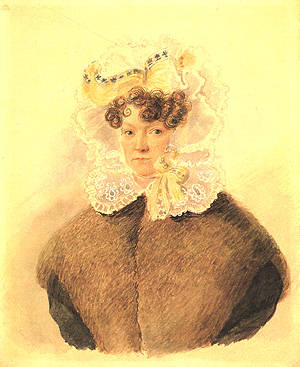
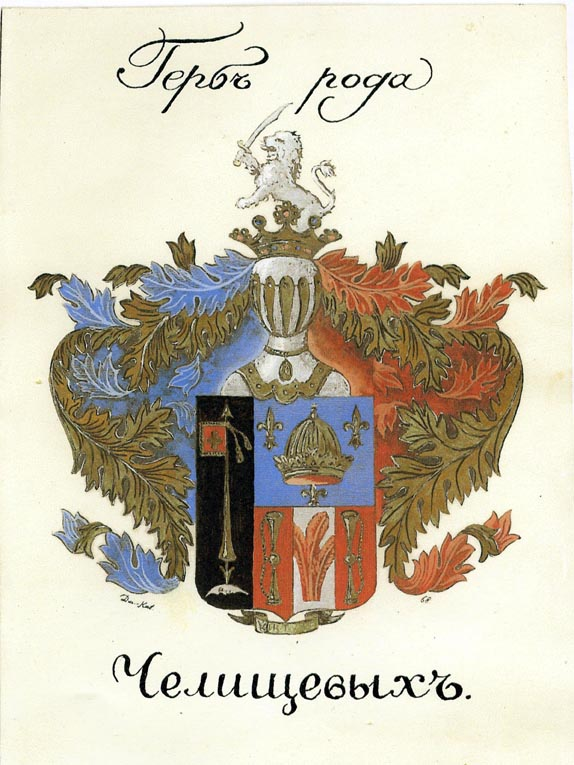
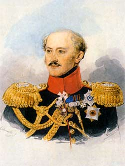
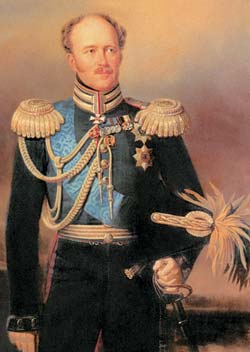
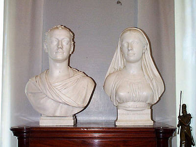

# Глава 4: Дворяне

Ланская Елизавета Ивановна — дочь инспектора классов при Peterschule в Петербурге, немецкого поэта Иоанна Готлиба Вилламова, и сестра известного статс-секретаря Императрицы Марии Феодоровны (супруги Павла I), Графа. Ивана. Вилламова, родилась в Петербурге 3 сентября 1764 года, умерла 8 октября 1841 г. Получила образование и воспитание в Воспитательном Обществе благородных девиц (Смольном), где ее мать была надзирательницею над классами. Вскоре по выходе из Смольного молодая Вилламова была взята ко двору великого князя Павла Петровича в качестве наставницы великого князя Александра I, в 1797 г. вступила в брак с Сергеем Сергеевичем Ланским; император Павел пожаловал ей 600 душ крестьян и мужа ее сделал камергером. 

Е. И. Ланская от отца своего унаследовала любовь к литературе, сама занималась литературою и пользовалась приязнью лучших русских писателей своего времени, в том числе Державина. Она издала три тома своих произведений, различных рассказов, ныне забытых, на французском языке. Павловка была во владении Ланской до 1821 года, когда она продала землю вместе со своими крепостными, переселенными из имения Ефремовского уезда Тульской губернии тайному советнику Николаю Александровичу Челищеву.

Челищев вместе с Павловкой купил у Ланской еще и другое принадлежащие ей имение — Большая Талинка. Известно, что это было поселение дворцовых крестьян. В 1762 г. в нем числилось 1973 человека и 260 домов. По тогдашнему времени это было большое село. В конце 90-х гг. XVIII в. Большая Талинка, также как и Павловка, была подарена семье Ланских. В документах ревизской сказки 1834 г. записано: «Село Большая Талинка тайного советника сенатора Николая Александровича Челищева, о состоящих мужска и женска пола крестьян, доставшиеся ему по купчей крепости в 1821 г. от тайной советницы Елизаветы Ивановны Ланской...». Всего у помещика Челищева насчитывалось 1025 человек крепостных.[^13] Сейчас это село Старое Челищево Бондарского района. Есть сведения, что после покупки Павловки, супруги Челищевы переселили туда половину жителе Большой Талинки. Хозяйствовали они в Павловке исправно, овчарный завод Челищевых насчитывал 1012 голов,[^4] а на конном заводе лошадей было 149 голов.[^14]

Челищевы — старинный дворянский род, ведущий свое начало от Ричарда Львиное сердце. Согласно легенде, потомок ливонского рыцаря Вильгельм Люнебургский приехал в Великий Новгород в 1237 г., принял в крещении имя Леонтий, служил стратегом при дворе Александра Невского и, по некоторым данным, именно он разрабатывал стратегию Ледового Побоища. Правнук Андрея Леонтьевича, Михаил Андреевич, по прозванию Бренко или Бренок, был любимым боярином великого князя Дмитрия Ивановича Донского и пал, облеченный, по рассказу летописца, самим Донским в великокняжескую одежду, в Куликовской битве.

Его тело было найдено под грудой убитых воинов, разрубленное в чело. Именно после этого по преданию Бренки получили фамилию Челищевы, хотя и ранее в роду бытовала фамилия Чело. Есть предположение, что фамилия восходит к итальянскому чело-небо, хотя Челищевых действительно отличает высокий лоб — чело. Во времена Екатерины Великой род Челищевых разветвляется на две ветви. Новая ветвь образована от незаконнорождённого сына императрицы графа Бобринского-Челищева. Императрица умышленно породнила своего отпрыска с древнейшим родом, переплетённым с ветвью Рюриковичей. Ротмистр Михаил Челищев погиб в Бородинском сражении, разрубленный опять же в чело.

Да и сам Н.А. Челищев (1783–1859 гг.) — личность неординарная, с необычной судьбой. Получив образование в Пажеском корпусе, Николай Александрович в 1800 г. выпускается поручиком в знаменитый лейб-гвардии Семеновский полк. Через пять лет он уже в гуще военных событий, участвуя во многих знаменитых сражениях Наполеоновских войн. В чине штабс-капитана он был ранен и контужен в сражении под Аустерлицем, за храбрость награжденный золотым оружием с надписью "за храбрость". Не захотев после лечения оставаться в тылу, в России, Н.А. Челищев вновь участвует в сражениях с наполеоновской армией, в битве под Фридландом, где он был вновь ранен и контужен, за что получает чин капитана и орден Св. Владимира 4 степени и через несколько дней чин полковника (1808 г.). Не имея возможности за многочисленными ранениями и плохим здоровьем продолжать военную карьеру, Н.А. Челищев определен на важные государственные посты: в 1811 г. в обер-прокурорский стол Сената в 1 департамент, в 1815 г. назначен обер-прокурором Комитета по недоимкам Сената. Уже после Отечественной войны 1812 г. Н.А. Челищев награждается высшими орденами: Белого Орла. 

Но по-видимому, названием селения - Сосновка мы обязаны другому семейству – Бенкендорфам. Именно тому его представителю-Александру Христофоровичу Бенкендорфу, который остался в истории как гонитель российского гения А.С. Пушкина, известному шефу III жандармского управления России.

Бенкендорф (Benkendorff), Александр Христофорович, граф (1783 - 1844), сын генерала Христофора Бенкендорфа, бывшего при императоре Павле военным рижским губернатором. Его бабушка по отцу была воспитательницей великого князя Александра Павловича, а его мать, (баронесса Анна Юлиановна Шиллинг фон Канштадт) была подругой детства императрицы Марии Федоровны (супруги Павла 1) и вместе с ней приехала в Россию. Смысл жизни Бенкендорфа состоял в службе. Офицер начинал своё восхождение к чинам, титулам и наградам при императоре Павле, продолжал при Александре I, а кульминационной высоты достиг при Николае I.

Образованный, исполнительный, уравновешенный, он идеально подходил бы любой военно-бюрократической власти. Русский императорский двор абсолютно соответствовал его дарованиям. В 15 лет юношу зачислили унтер-офицером в привилегированный лейб-гвардии Семеновский полк. Производство его в поручики также последовало очень быстро. И именно в этом чине он стал флигель-адъютантом Павла I. Причем, в отличие от многих его предшественников, изрядно намучившихся возле непредсказуемого императора, молодой Бенкендорф таких проблем не ведал. Хотя, надо сказать, благоприятные перспективы, связанные с почетной должностью флигель-адъютанта, его не прельщали. Рискуя вызвать Высочайшее неудовольствие, он в 1803 году отпросился на Кавказ, и это даже отдаленно не напоминало дипломатические вояжи в Германию, Грецию и Средиземноморье, куда император отправлял молодого Бенкендорфа.

Кавказ с его изнурительной и кровавой войной с горцами являлся настоящей проверкой на личное мужество и способность руководить людьми. Бенкендорф прошел ее достойно. За конную атаку при штурме крепости Ганжи он был награжден орденами Св. Анны и Св. Владимира IV степени. В 1805 году вместе с «летучим отрядом» казаков, которым он командовал, Бенкендорф разбил передовые неприятельские посты при крепости Гамлю. До сих пор оставленные им в своих записках характеристики горцев и анализ причин той войны, цитируются нашими современниками.

Кавказские баталии сменились европейскими. В прусской кампании 1806—1807 годов за битву при Прейсиш-Эйлау он был произведен в капитаны, а затем и в полковники. Затем последовали русско-турецкие войны под командованием атамана М.И. Платова, тяжелейшие бои при переправе через Дунай, взятие Силистрии. В 1811 году Бенкендорф во главе двух полков совершает отчаянную вылазку из крепости Ловчи к крепости Рущук через неприятельскую территорию. Этот прорыв приносит ему «Георгия» IV степени.

В первые недели наполеоновского вторжения Бенкендорф командует авангардом отряда барона Винценгороде, 27 июля под его предводительством отряд произвел блистательную атаку в деле при Велиже. После освобождения от неприятеля Москвы Бенкендорф был назначен комендантом разоренной столицы. В период преследования наполеоновской армии отличился во множестве дел, взял в плен трех генералов и более 6 000 наполеоновских солдат. В кампании 1813-го, став во главе так называемых «летучих» отрядов, сначала разбил французов при Темпельберге, за что был удостоен «Георгия» III степени, затем вынудил неприятеля сдать Фюрстенвальд. Вскоре он с отрядом был уже в Берлине. За беспримерное мужество, проявленное во время трехдневного прикрытия прохода русских войск к Дессау и Роскау, был награжден золотой саблей с алмазами.

Дальше — стремительный рейд в Голландию и полный разгром там неприятеля, затем Бельгия — его отрядом взяты города Лувен и Мехельн, где у французов были отбиты 24 орудия и 600 пленных англичан. Потом, в 1814-м, был Люттих, сражение под Красным, где он командовал всей конницей графа Воронцова, с которым дружил всю жизнь. Награды следовали одна за другой — помимо «Георгия» III и IV степеней, еще «Анна» I степени, «Владимир», несколько иностранных орденов. Одних шпаг за храбрость у него оказалось три. Войну он закончил в звании генерал-майора.

В марте 1819 года Бенкендорф был назначен начальником штаба Гвардейского корпуса.

Безупречная, казалось бы, репутация воина за Отечество, которая ставила Александра Христофоровича в ряд самых выдающихся военачальников, не принесла ему, однако, той славы среди сограждан, которая сопутствовала людям, прошедшим горнило Отечественной войны. Бенкендорфу не удалось походить в героях ни при жизни, ни после смерти. Его портрет в знаменитой галерее героев 1812 года у многих вызывает нескрываемое удивление. А ведь он был храбрым солдатом и отменным военачальником.

Беспокоясь за судьбу России, в сентябре 1821 года на стол императору Александру I была подал записку о тайных обществах, существующих в России, и в частности о «Союзе благоденствия». Она имела аналитический характер: автор рассматривал причины, сопровождавшие возникновение тайных обществ, их задачи и цели. Здесь же высказывалась идея о необходимости создания в государстве специального органа, который бы мог держать под надзором настроение общественного мнения, а если надо, то и пресекать противоправную деятельность. Но помимо всего прочего в ней автор называл поименно тех, в чьих умах поселился дух свободомыслия. И это обстоятельство роднило записку с доносом.

Искреннее желание предотвратить расстройство существующего государственного порядка и надежда на то, что Александр вникнет в суть написанного, не оправдались. Общеизвестно сказанное Александром об участниках тайных обществ: «Не мне их судить». Это выглядело благородно: император и сам, было дело, вольнодумствовал, замышляя крайне смелые реформы.

А вот поступок Бенкендорфа как раз был далек от благородства. 1 декабря 1821 года раздраженный император отстранил Бенкендорфа от командования Гвардейским штабом, назначив его командиром Гвардейской кирасирской дивизии. Это была явная немилость. Бенкендорф в тщетных попытках понять, чем она вызвана, снова писал Александру. Вряд ли он догадывался, что императора покоробила эта бумага и он преподал ему урок. И все же бумага легла под сукно без единой пометки царя. И энергичная характер Бенкендорфа нашел свое применение в другой области.
За военные заслуги, Павел 1 в 1799 году пожаловал Бенкендорфам значительную часть земель в Тамбовской губернии, а вместе с ними и крестьян, проживающих на этих землях, которые автоматически при этом становились крепостными. Бенкендорф уезжает в Сосновку (ту, которая в Моршанском уезде) Кстати, в 19 веке она именовалась Бенкендорф-Сосновкой, и, со всей пылкостью своего характера, принимается обустраивать свое имение, закладывается железнодорожная станция, суконная фабрика, мельницы, стоиться базар. Сосновка становится центром хлебной торговли. С 1767 года в Сосновке существовал купоросный завод купцов Прокудиных, которому принадлежали и близлежащие так назывемые «купоросные» земли. Последние владельцы завода задумали разнообразить прочно поставленное производство, но увлеклись нововведениями и обанкротились. Земли завода были куплены графом Бенкендорфом, которым завод уничтожен.

Однако, государственную службу при этом оне не оставлял. Если служба требовала простой храбрости, нерассуждающей отваги – Бенкендорф бывал на месте. Столичные жители запомнили его самоотверженный порыв в часы знаменитого петербургского наводнения 1824 года Во время наводнения 1824 в Петербурге он был временным военным губернатором Васильевского острова. А.С. Грибоедов, коего трудно было удивить бесстрашием, рассказывал о невском "потопе":

"В эту роковую минуту государь (Александр I) явился на балконе. Из окружавших его один сбросил мундир, сбежал вниз, по горло вошёл в воду, потом на катере поплыл спасать несчастных. Это был генерал-адъютант Бенкендорф. Он многих избавил от потопления, но вскоре исчез из виду, и во весь день о нем не было вести". Перейдя набережную, когда вода доходила ему уже до плеч, генерал Бенкендорф добрался до катера, на котором находился мичман гвардейского экипажа Беляев. До 3 часов ночи вместе они успели спасти огромное число людей. Александр I, получивший множество свидетельств мужественного поведения Бенкендорфа в те дни, наградил его бриллиантовой табакеркой. Благородный поступок Бенкендорфа получил широкий резонанс и вызвал положительные отклики современников. В одном из номеров журнала "Новости литературы" даже было опубликовано стихотворение, посвященное Бенкендорфу. 

Прошло несколько месяцев, и императора не стало. А 14 декабря 1825-го Петербург взорвался Сенатской площадью. То, что в конце концов стало едва ли не самой возвышенной и романтичной страницей русской истории, свидетелям того памятного декабрьского дня таковым не казалось. Очевидцы пишут об оцепеневшем от ужаса городе, о залпах прямой наводкой в плотные шеренги восставших, о тех, кто мертвыми падали лицом в снег, о ручейках крови, стекавших на невский лед. Потом — о запоротых солдатах, повешенных, сосланных в рудники офицерах. Бенкендорфу же казалось, что налицо явная начальственная промашка и страшный убыток государству даже в том, что отличному человеку мичману Беляеву, с которым они в ту безумную ночь сновали, как по морю, по всему Петербургу, 15 лет теперь гнить в сибирских рудниках.

Но именно те трагические дни положили начало доверию и даже дружеской приязни нового императора Николая I и Бенкендорфа. Остались свидетельства, что утром 14 декабря, узнав о бунте, Николай сказал Александру Христофоровичу: «Сегодня вечером, может быть, нас обоих не будет более на свете, но по крайней мере мы умрем, исполнив наш долг».

Бенкендорф свой долг видел в защите самодержца, а значит, государства. В день бунта он командовал правительственными войсками, расположенными на Васильевском острове. Потом был членом Следственной комиссии по делу декабристов. Заседая в Верховном уголовном суде, он не раз обращался к императору с просьбами о смягчении участи заговорщиков, хорошо при этом зная, насколько принималось Николаем в штыки всякое упоминание о преступниках.

Жестокий урок, преподанный императору 14 декабря, не прошел даром. Волею судеб тот же день изменил и судьбу Бенкендорфа.

В отличие от царственного брата Николай I внимательнейшим образом ознакомился со стародавней «запиской» и нашел ее очень дельной. После расправы с декабристами, стоившей и ему немало черных минут, молодой император всячески стремился устранить возможные повторения подобного в будущем.

В январе 1826 года Бенкендорф представил Николаю «Проект об устройстве высшей полиции», в котором, кстати, писал и о том, какими качествами должен обладать ее шеф, и о необходимости его безусловного единоначалия. Указ от 25 июня 1826 года сделал Бенкендорфа шефом жандармов и командующим императорской главной квартирой. В 1828 г. при отъезде государя к действующей армии, в Турцию, Бенкендорф сопровождал его; был при осаде Браидова, переправе русской армии через Дунай, покорении Исакчи, в сражении при Шумле и при осаде Варны; в 1829 г. он произведен в генерала от кавалерии, а в 1832 г. возведен в графское достоинство, а, за неимением у него сыновей, графское достоинство было распространено на его племянника, Константина Константиновича Бенкендорфа, которому впоследствии и достануться тамбовские имения графа.

Почти два десятилетия Бенкендорф неустанно сопровождал своего государя. И всё же императора Николая и графа Бенкендорфа связывали чувства более тёплые, чем обычная служебная приязнь. Решающую роль сыграли тут поездки государя по стране. Провозгласив себя реформатором, новым Петром Великим, Николай то и дело срывался с места, скакал то в Финляндию, то к Чёрному морю, то в Москву, то в Польшу, то в Украину. Место в дорожной карете подле императора обычно занимал Бенкендорф. В сословном быту даже минутный, мимолётный разговор с императором считался высочайшей честью; о нём вспоминали, передавали потомкам. А граф беседовал с царём во время долгих прогонов – днями, неделями. Из года в год.

В какую-нибудь Пензу или Смоленск государь любил нагрянуть неожиданно, застать врасплох губернатора, чиновников, военных. Тогда приходилось ехать рискованно, без охраны и сопровождения. Тут главный полицейский, министр, превращался в простого телохранителя. Бенкендорф предвидел, что однажды такие прогулки плохо кончатся. В августе 1836 года случилось то, что царь и граф называли между собой "кувыркколлегией". Ночью на грязной гористой дороге между Пензой и Тамбовом при подъезде к Чембару закрытая коляска перевернулась. Бенкендорф не пострадал, а его величество изволили сломать себе ключицу.

Граф, понятно, испугался. Но скоро успокоился и даже обрёл способность рассуждать философски:
– Видя передо мною сидящим на голой земле с переломанным плечом могущественного владыку шестой части света, которому, кроме меня, никто не прислуживал, – рассказывал Бенкендорф, – я был невольно поражён этою наглядною картиною суеты и ничтожества земного величества. Государю пришла та же мысль, и мы разговорились об этом с тем религиозным чувством, которое невольно внушала подобная минута. Нам пришлось добираться пешком...
Вот, оказывается, какие непридворные (и непритворные?) мысли посещали Александра Христофоровича. Только вряд ли мы о них узнали бы, если б сам царь, взволнованный и страдающий от боли, не подтвердил бы мнения своего вельможи. Бенкендорф обычно не расслаблялся, умел держать язык и перо на коротком поводке.
Та поездка в Пензу и Тамбов оказалась для графа одной из последних.
С 1837 года влияние Бенкендорфа стало падать. Он болеет, всё чаще отдыхает в своём остзейском имении Фалль. Замок был возведен в 1828-1835 годах архитектором Андреем Ивановичем (Генрихом Иоганном) Штакеншнейдером Замок был задуман в новоготическом (или байроновском) стиле. Двадцатиметровая восьмиугольная башня, увенчанная зубцами, широкое крыльцо с беломраморными львами и вазами. Павильоны из чугуна и стекла. Вокруг замка - богатые цветники, статуи. Государь Николай Павлович дважды - в 1828 и 1833 гг. - посещал здесь семью Бенкендорфов и собственноручно посадил в парке несколько деревьев.

Адъютант графа Бенкендорфа Алексей Львов — автор знаменитого гимна «Боже, Царя храни» — построил в усадьбе мост, о котором император Николай I сказал так: «Львов построил не мост, а перекинул через овраг свой лёгкий смычок». В парке также был построен готический домик, над которым красовалась надпись: «Трактир село Сосновка». Всегда помнил Александр Христофорович красоту Тамбовской земли.

Граф Бенкендорф умер в 1844 году. Узнав о кончине своего верного слуги, Николай I с благодарностью произнес: «В течение долгих лет он ни с кем меня не поссорил, а примирил со многими». В устах жестокого монарха, столь скупого на похвалу, эти слова значили немало!

А тамбовские имения перешли к сыну его геройски погибшего брата Константину Константиновичу Бенкендорфу.

В Моршанском историко-художественном музее в Тамбовской области хранятся мраморные бюсты Константина и Натали Бенкендорф работы скульптора Даннекера. 

Он поступили в музей в 1919 г. из имения Бенкендорфов в Сосновке. В книге известного путешественника В. П. Семенова-Тяньшанского «Россия» дана следующая характеристика имения графа Бенкендорфа: «Сосновское имение графа Бенкендорфа (4500 десятин) замечательно по своему лесному хозяйству (1000 десятин леса), садоводству и овцеводству».В 1894 году имение графа было соединено железнодорожной веткой Сосновка - Богоявленск с дорогой Москва - Тамбов. С постройкой ветки доходы графа Бенкендорфа от имения значительно возросли. Из Сосновки ежегодно отправлялось 740 тысяч пудов груза, в том числе 540 тысяч пудов хлеба. Вывозили лес, мясо, шерсть и другое сельскохозяйственное сырье. В Сосновке тогда уже работал спиртовой, винокуренный, крахмалопаточный, веревочный заводы, у железнодорожной станции располагались купеческие лабазы и хлебные склады, ежегодно проводились Всероссийские ярмарки.

К сожалению, в нашей Сосновке Тамбовского уезда, Бенкендорф не бывал, однако, названием наше село обязано ему. Итак, обо всем по-порядку.

[^4]: Памятная книжка Тамбовской губернии на 1873 год. Издание Тамбовского губернского статистического комитета. Тамбов. Типография губернского правления. 1873 г.
[^13]: Н. В. МУРАВЬЕВ. ИЗБРАННЫЕ КРАЕВЕДЧЕСКИЕ ТРУДЫ
[^14]: Военнно-статистическое обозрение Российской империи.т.8.часть1. Тамбовская губерния. Санкт-Петербург. Типография генерального штаба.1851 г.