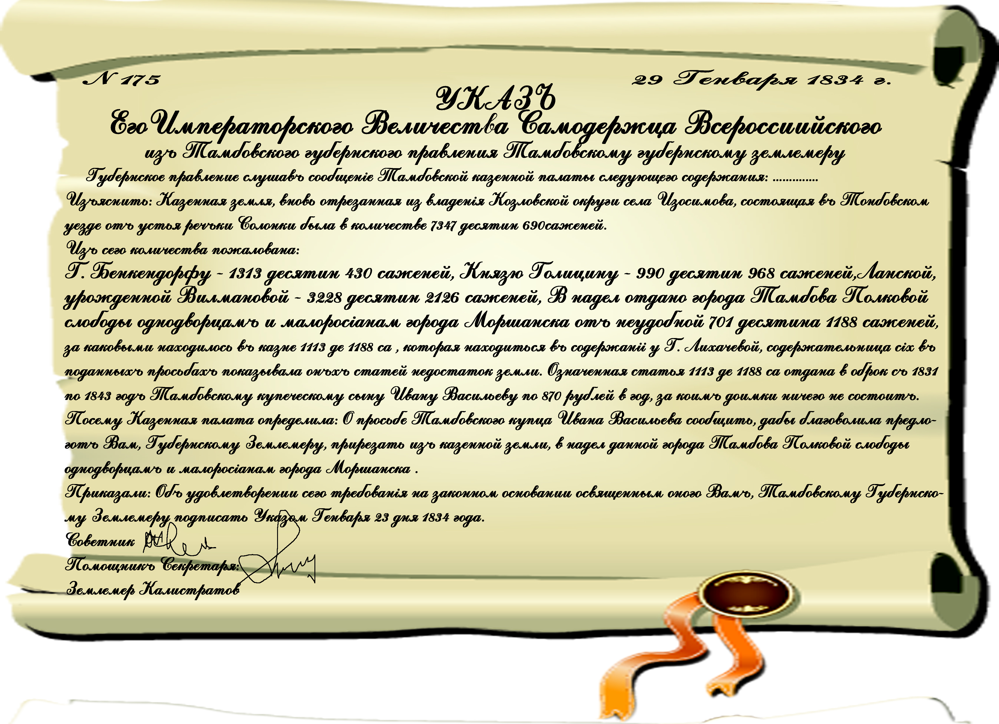

# Глава 5: Административное деление Тамбовской земли

И почему тогда в качестве смежеств в приведенных межевых книгах Сосновка не упоминается? Ответ на этот вопрос мы найдем в большом деле Тамбовской губернской чертежной палаты, которое называется «Дело о проверке количества казенной земли в с. Изосимово Тамбовского уезда, взятой в оброк подпоручицей Лихачевой за декабрь1825 –январь 1839 г.»12 В лучших традициях Российского чиновничества почти 14 лет длилось разбирательство в различных инстанциях, козловском, лебедянском и усманском уездных судах , губернском правлении, потребовалось даже обращение к царю, чтобы выяснить, почему на бумаге отданной в казенный оброк земли числиться 1113 десятин 1188 саженей, на них и начисляется арендная плата, а фактически есть только 989 десятин. В материалах этого дела мы находим следующие пояснения, проливающие свет и на происхождение и на название наших селений:

Итак, в устье реки Солонки, там где сейчас стоит современная Павловка, переселенцы села Изосимово Козловского уезда заложили первое поселение. Село Изосимово, как и другие однодворческие села, было основано одновременно со строительством укрепленных городов-крепостей Тамбова и Козлова, являющихся составной частью Белгородской оборонительной черты. Через сто с лишним лет потомки служивых людей остро ощущали недостаток в земле, выпасах для скота, сенокосных угодьях, поэтому часть семей переселялась на юг и неосвоенные участки «дикого поля».13
Так появились поселения жителей Полковой слободы Тамбова, инородцев (татар, мещер и мордвы, в 16-17 веке принявших христианскую веру) города Моршанска.

В другом, более позднем документе о межевании я нашла дату образования Новосильцева- 1775 год июня 24 дня. А датой образования сельца Павловское, видимо, является дата указа Павла 1 о всемилостивейшее пожаловании этой земли камергерше Е.И. Ланской- 1798 года июня 22 дня.

Ланская Елизавета Ивановна — дочь инспектора классов при Peterschule в Петербурге, немецкого поэта Иоанна Готлиба Вилламова, и сестра известного статс-секретаря Императрицы Марии Феодоровны (супруги Павла I), Графа. Ивана. Вилламова, родилась в Петербурге 3 сентября 1764 года, умерла 8 октября 1841 г. Получила образование и воспитание в Воспитательном Обществе благородных девиц (Смольном), где ее мать была надзирательницею над классами. Вскоре по выходе из Смольного молодая Вилламова была взята ко двору великого князя Павла Петровича в качестве наставницы великого князя Александра I, в 1797 г. вступила в брак с Сергеем Сергеевичем Ланским; император Павел пожаловал ей 600 душ крестьян и мужа ее сделал камергером. 

Е. И. Ланская от отца своего унаследовала любовь к литературе, сама занималась литературою и пользовалась приязнью лучших русских писателей своего времени, в том числе Державина. Она издала три тома своих произведений, различных рассказов, ныне забытых, на французском языке. Павловка была во владении Ланской до 1821 года, когда она продала землю вместе со своими крепостными, переселенными из имения Ефремовского уезда Тульской губернии тайному советнику Николаю Александровичу Челищеву. 

