# Глава 9: История села Сосновка и Александровка

К сожалению, в нашей Сосновке Тамбовского уезда, Бенкендорф не бывал, однако, названием наше село обязано ему. Итак, обо всем по-порядку.
Разыскивая в архивах метрические книги местной церкви, я была весьма удивлена названием моего населенного пункта в описании Тамбовской епархии за 1876 год:

5-й Тамбовский округ
1. В селе. Александрове, Покровская деревянная, построена в 1844 г., престол один, главная. При ней в с. Семеновке, Николаевск., д. пост. 1863 г.,прест. один, приписная. 
Шт. Наст., помощн. и 2 псал. 
Наст. свящ. Степ. Гр. Богородицкий, студ., р. 1841 г. 
Помощн. свящ. Ив. Ив. Романовский, студ., р. 1875 г. 
Ц. стар. при Покровск. кр. Акинфиев, 1864 г., при Николаев. госуд. кр. Матф. Кулин, 1869 г
Благочинный 5 Тамб. округа свящ. Покровской ц. с. Александровки Степ. Григ. Богородицкий, в д. 1873 года. 17

А вот списки волостей Тамбовского уезда по данным 1862 года.

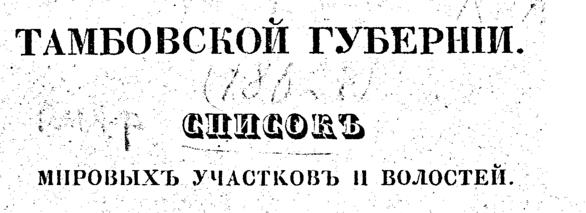

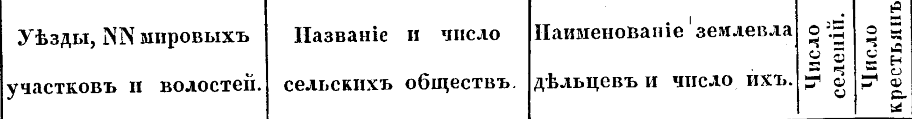

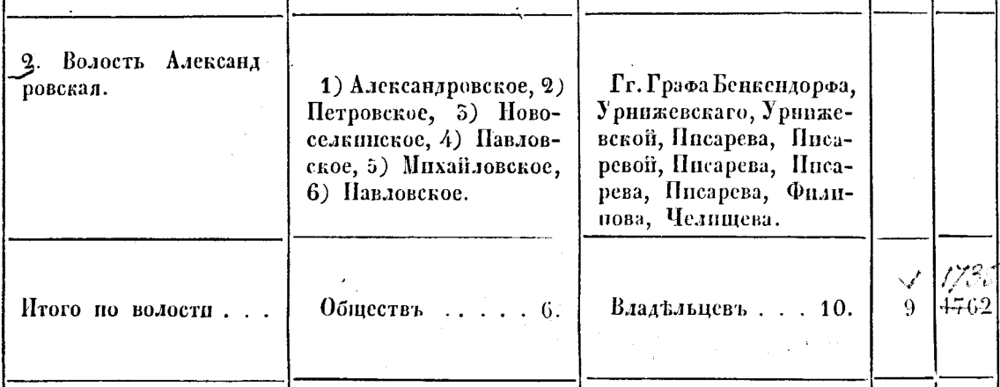

Предполагаю, что названием село Александровка обязано своему владельцу Александру Васильевичу Писареву. В межевой книге дачи (от слова «дать» - так назывались все поместья тогдашнего периода), образовавшейся по специальному межеванию под названием сельца Александровского Тамбовского уезда на июнь 1852 года есть указание на то, что оно было вымежевано из двух дач:15 Из дачи камергерши Ланской Е.И., на которой ныне расположено сельцо Павловское Челищево тож и деревни Пласкуши Новосильцевой Тамбовского уезда. Во время межевания означенного участка внутри окружной межи в поселении состоит сельцо Александровское, где вышеназванному владельцу принадлежит шесть дворов. По последней 9 ревизии (1834 год)оказалось тридцать пять мужского и тридцать девять душ женского пола. Примечательно, что в качестве свидетелей межевания были привлечены села Александровки графа Бенкендорфа крестьяне Митрофан Ермолаев, Никифоръ Марков, Иван Казъмин, Спиридон Никифоровъ.

На плане под владениями Александра Васильевича Писарева обозначено 259 десятин 2176 саженей. Интересно описание смежеств: 
- от А до В: Земли дачи, образованнной по специальному межеванию подъ названием сельца Петровского, вымежеванного из дачи Всемилостивейше пожалованной земли действительной камергерши Елизаветы Ивановой Ланской, на которой нынъ поселено Сельцо Павловское Челищево тож, соединенная дачей деревни Пласкуши Новосильцевой, владения коллежского регистратора Петра Васильевича Писарева.
- От В до С: Земли дачи, образованнной по специальному межеванию подъ названием сельца Петровского из дачи деревни Пласкуши Новосильцевой, соединенная вышеназванной дачей, владения коллежского регистратора Петра Васильевича Писарева.
- От С до D: Земли дачи, образованнной по специальному межеванию подъ названием сельца Павловского Челищево тож из дачи Всемилостивейше пожалованной земли действительной камергерши Елизаветы Ивановой Ланской, на которой нынъ поселено Сельцо Павловское Челищево тож и второй деревни Пласкуши Новосильцевой, владения действительного Тайного Советника и кавалера Николая Александровича сына Челищева.
- От D до Е: Земли дачи, образованнной по специальному межеванию подъ названием деревни Павловской Пласкуша Новосильцева тож, соединенная с дачей Всемилостивейше пожалованной земли действительной камергерши Елизаветы Ивановой Ланской, на которой нынъ поселено сельцо Павловска Челищево тож, владения поручика Павла Васильевича Писарева.
- От Е до А: Земли дачи, образованнной по специальному межеванию подъ названием деревни Павловской Пласкуша Новосильцева тож, соединенная с дачей Всемилостивейше пожалованной земли действительной камергерши Елизаветы Ивановой Ланской, на которой нынъ поселено сельцо Павловска Челищево тож, владения поручика Павла Васильевича Писарева.
Полностью о владельцах земель можно узнать из списка межевых книг 1856 года.16 Деревня Толмачева(Плоскуша) была разделена на 7 частей.
1 часть - 228 десятин и 4 часть - 16 десятин принадлежала Урнижевской Любовь Семеновне, 2 часть - 78 десятин – порчику Урнижевскому Николаю Федоровичу, 3 часть - 28 десятин - подпоручице Писаревой Елизавете Андреевне, а остальные - 71 десятина – липецкому 2-й гильдии купцу Петрову Вакуле Ильичу, доставшиеся ему по продаже от Василия Петровича Воейкова - одного  из наиболее талантливых русских коннозаводчиков, владельца Лавровского конезавода. При том межевании были владельцы земель, да понятые сторонние люди Тамбовского уезда разных селений крестьяне: села Александровки графа Константина Константиновича Бенкендорфа Максим Ивановъ Микининъ, Спиридон Никифоровъ Шепелевъ, Яковъ Юдовъ Микининъ, Петръ Алексеевъ Рыжковъ, Иван Матвеевъ Стрельниковъ,Емельян Аверьяновъ Шепелевъ, из сельца Павловского господина Николая Александровича Челищева Андрей Степановъ, Матвей Тихановъ, Семенъ Алексеевъ, Иван Карповъ, Игнат Степановъ, Иван Семеновъ. За Вакулу Ильича, а вместо его за неумением грамотъ по личной просьбе капитан Лаврентий Захаровъ Маслов руку приложил. Вместо понятых сторонних людей, коих имена и прiзвания писали выше сего в межевой книге, а за неумениемъ грамоты по прошению села Александровки дiакон Федор Леонтьевъ Малышкинъ руку приложил. При межевании 3 части сделана пометка, что Писаревой Е.А. не было, а за болезнею ея, по личной ея просьбе, племянник ея Коллежский регистратор Александр Васильев Писарев руку приложил.

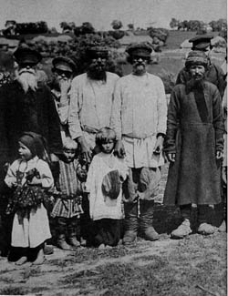

При межевании 7 части,первоклассный землемер секунд-майор Афанасий Маслов сообщал: В качестве межевого знака вырыта мной межевая яма, которая во все четыре стороны по полторы, а в глубину одна сажень. Ориентирами служили речки Пласкуша и Березовка и безымянный проток, запруженный на ономъ пруду до плотины. Как правило, землемеры использовали большие камни, но в нашем краю их было немного. Под посеянными огородами, гуменниками и конопянником занято четыре десятины одна тысяча триста сажень. На семъ числе, во время межевания земли означенного участка состояла в поселении часть деревни Толмачевой Пласкуша тож, в коей за бывшею госпожой владелицей Григорьевой по 9 ревизии (1850 г.) числиться два двора, в них мужеска пола шестнадцать и женска пола двеннадцать душ. В смежествах числились казенные земли, оставленные опекунскими межевщиками под население иностранцевъ, ныне въ владении Тамбовской палаты государственного имущества, Всемилостивейше пожалованные генералу от инфантерии графу Ал-дру Христофоровичу Бенкендорфу земли, на которых поселено село Александровка, Всемилостивейше пожалованные земли действительной камергерши Елизаветы Ивановой Ланской, на которых нынъ поселено Сельцо Павловское Челищево тож, владения действительного Тайного Советника Николая Александровича Челищева, земли шестого участка части деревни Толмачевой, Пласкуша тож, владения Липецкого 2-й гильдии купца Вакула Ильина Петрова.

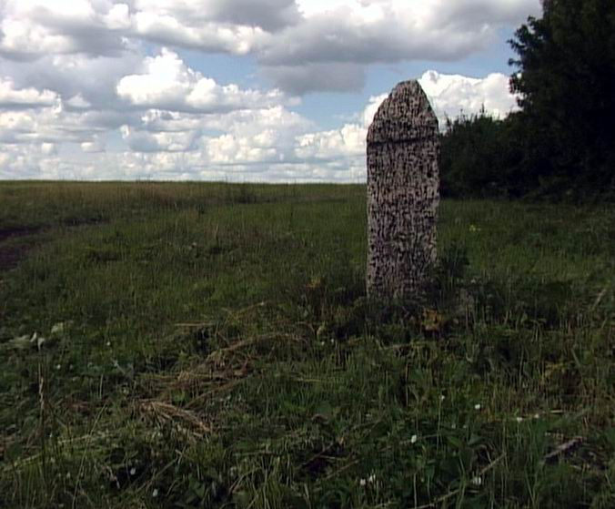

Однако, в ревизских сказках последней 10 ревизии за 1858 год 18 присутствует Александровка Тамбовского уезда помещика, колежского советника Василия Петровича Воейкова, за которым числиться 107 душ мужского и 125 женского пола. Даже если предположить, что это Александровка, расположенная немного севернее Лавровки, где и были основные владения помещика, то учитывая, что он владел частью наших земель, название могло появиться и оттуда.

Всего в Тамбовской губернии к тому времени насчитывалось 82 Александровки (11 из них в Тамбовском уезде), 9 Александровских, 4 деревни Пласкуша, и только еще одна Сосновка (второе название токаревской Павлодаровки - тоже имения Бенкендорфов). Из 32 волостей Тамбовского уезда две назывались Александровскими, да еще 2 в других уездах. Александровское сельское общество есть и в Сосновской волости Моршанского уезда. Потому все три версии появления названия Александровка ( по связи с владельцами-Бенкендорфом, Воейковым и Писаревым) имеют место быть. Хотелось бы отметить, что волостным центром Александровка - Сосновка становиться примерно к 1865 году. Вот карта из атласа Грибовского за 1843 год, где отмечены только волости и сельские общества, их составляющие.

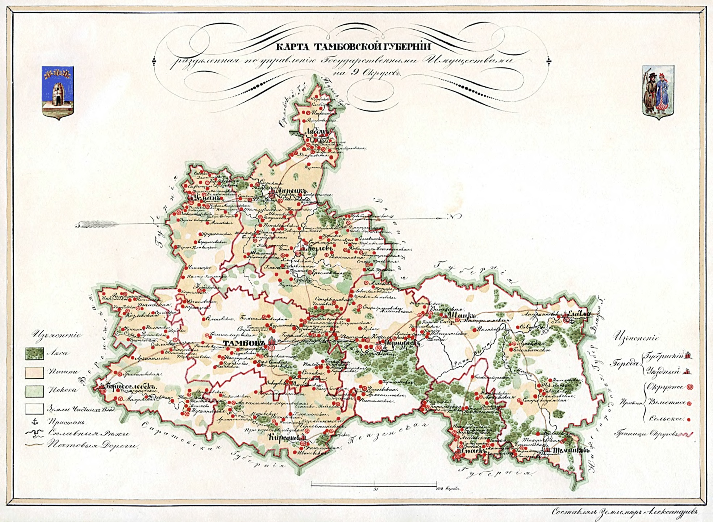

Ревизские сказки окрестных деревень дают нам ответ, в какую же волость входила наша местность: 18 Ревизская сказка тысяча восемьсот пятьдесят восьмого года, февраля двадцать второго дня, Тамбовской губернии, Тамбовского уезда, Большелазовской волости Семеновского сельского общества о состоящих мужеска и женского пола государственных крестьянах деревни Березовки Коровино тож.

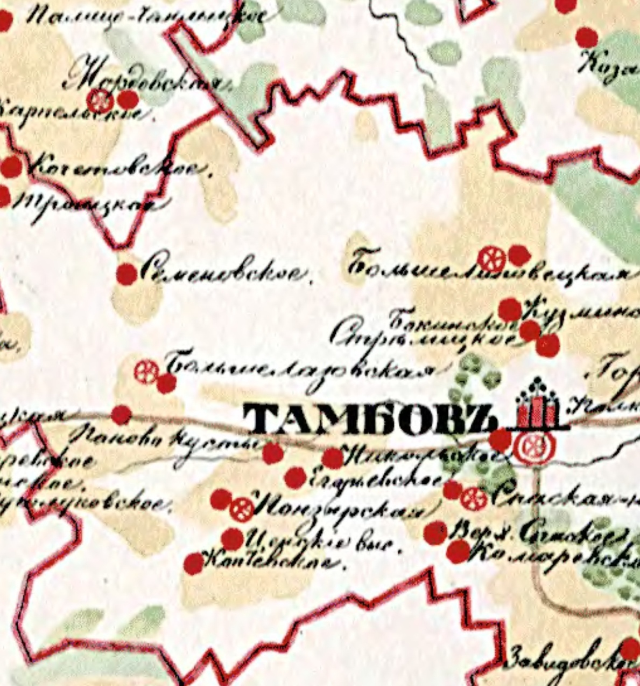

В Коровино тогда жили 29 мужского и 27 женского пола, да одна солдатская вдова с ребенком. Почти все Евтеевы или Евсеевы, Степанов, Королев, Тарас Дмитриевич Пономарев, 72 лет от роду. В Березовке Малышкино тож проживало 136 человек мужского и 140 женского пола госудаственных крестьян. Встречаются фамилии Адинцов и Одинцов, Прохорков, Сапожников, Ефимов, Батуров, Платонов, Ананьев, Ефим Семенович Малышкин. Меня заинтересовал Николай Григорьев Богородицкий, 63 лет. Не родственник ли он священнику нашей церкви? Значит, тогда и первый священник Покровской церкви был своим, местным.

Среди ревизских сказок 1858 года сохранилась еще одна: Сказка 29 мая 1858 года деревни Пласкуша(Лихачевка) титулярной советницы Александры Степановны Григорьевой (14 человек мужского пола) с пометкой, что дворовые отпущены на волю в 1860 году. Помните, при межевании 7 части: «за бывшею госпожой Григорьевой состоит?..» Что бы сие означало, ведь крепостное право еще отменено не было?

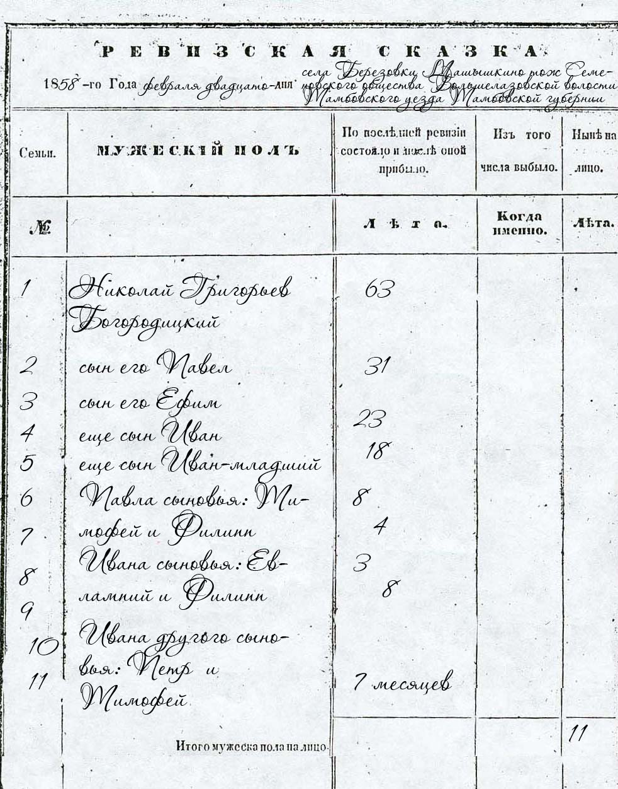

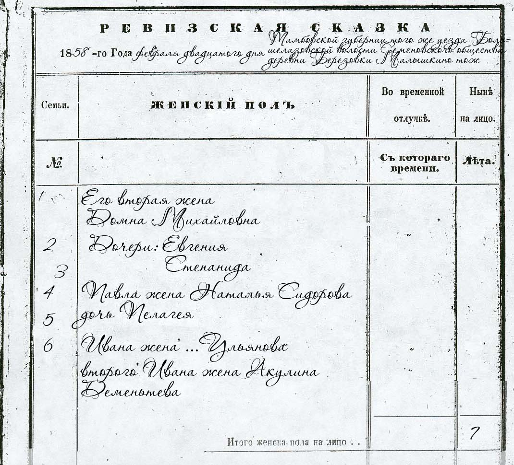

Судя по епархиальным источникам, церковь в нашем селе построена была в 1844 году тщанием прихожан, метрические книги ведуться с того же года, службы начались в 1842 году.  Священник Степан Григорьевич Богородицкий, студент, рукоположен в 1841 году. Вот как озаглавлена метрическая книга 1848 года: «Метрическая книга, данная из тамбовской духовной консистории въ одноштатную церковь села александровки-сосновки 5 стан тамбовского уезда».19 
Посмотрим и почитаем записи книги, в ней найдется немало интересного и о именах наших предков, и о местах, откуда они пришли, и о нравах. Вот эти документы:

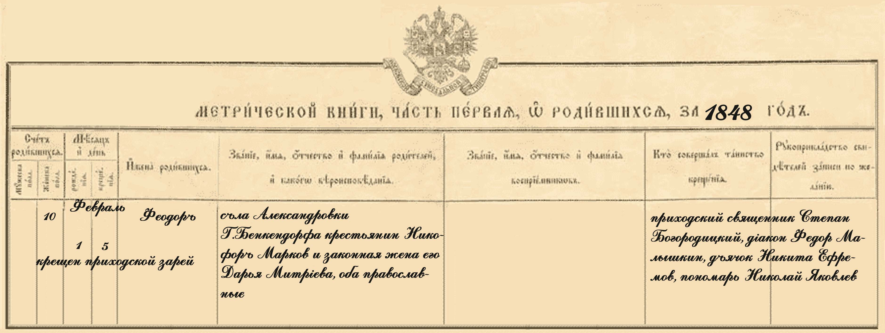

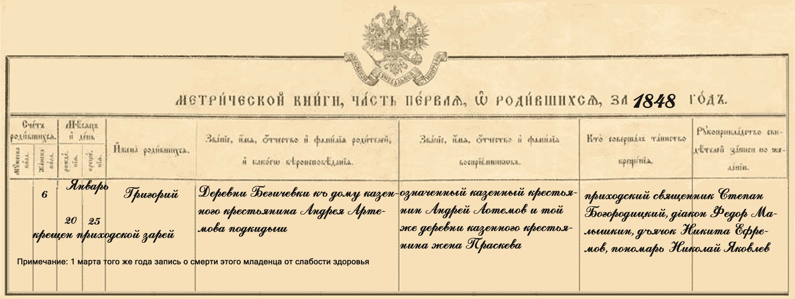

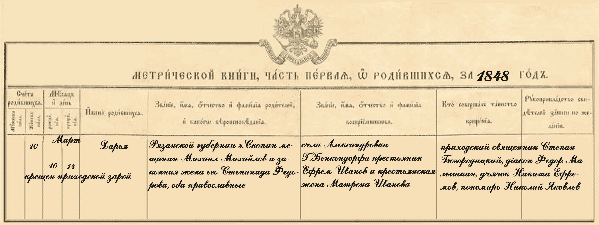

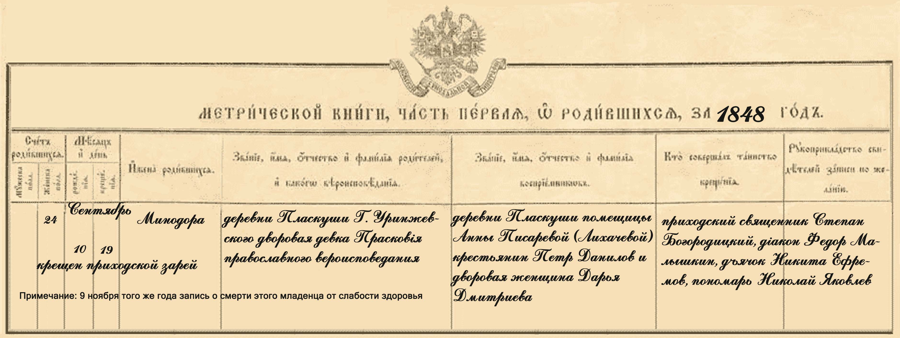

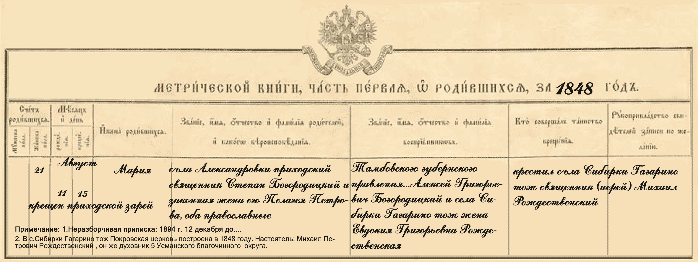

Читая последнюю запись, я вдруг отчетливо представила себе, какой праздник был у священника, когда в августе 1848 года крестили его дочь. Приехал с женой друг по семинарии или родственник, скорее всего, брат жены, который провел службу, в качестве крестного, или, как говорили тогда, воспреемника, был приглашен, по-видимому, брат. Кто они, эти люди? Какими они были? Одно известно из этих записей наверняка: «оба православные». Неизменна на нашей земле была христианская вера. 

Всего за тот год родилось 41 девочка и 52 мальчика, было заключено 18 браков. Есть записи и в третьей части этой книги- об умерших. Всего умерло 69 человек (39 мужчин и 30 женщин), из них младенцев до 2 лет- 40 человек, преимущественно от поноса, да от слабости здоровья, 11 человек трудоспособного возраста от простуды (грудной болезни) и от холеры. Встречается запись от смерти 70-летнего Ксенофонта Павлова, крестьянина Моршанской округи деревни Шереметьева помещицы Писаревой.

Интересны и метрические книги за 1870 год.

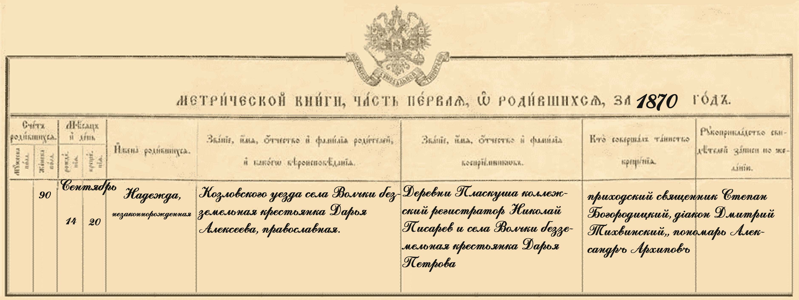

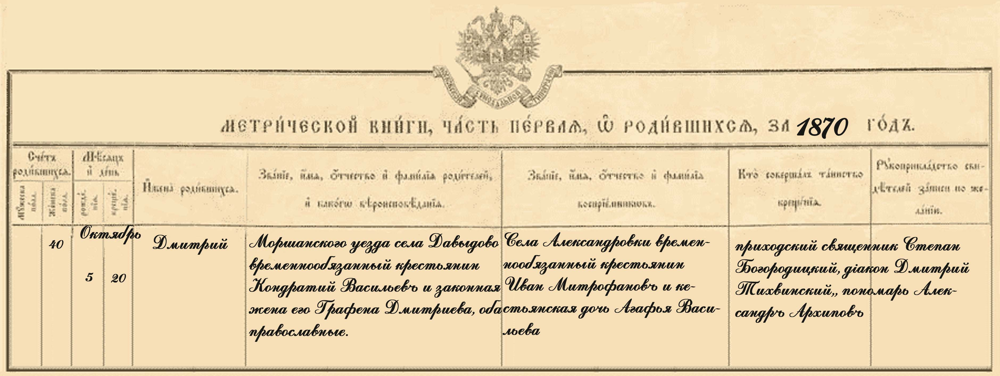

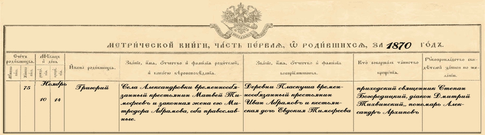

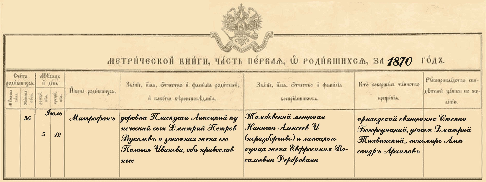

Уже нет принадлежности к помещику, крестьяне называются временнообязанные, только не встречаются привычные нам географические названия, все село Александровка, да деревня Пласкуша. К этому  времени наше село становиться волостным центром, стан при этом распологался в селе Абакумово в 20 верстах , все чаще именуется Сосновкой и волость называется Сосновской.20

В 1894 году Сосновская волость входила в состав Покрово-Марфинского стана. В Сосновке был уряднический участок, фельшерский пункт, земская школа и школа грамотности. 21

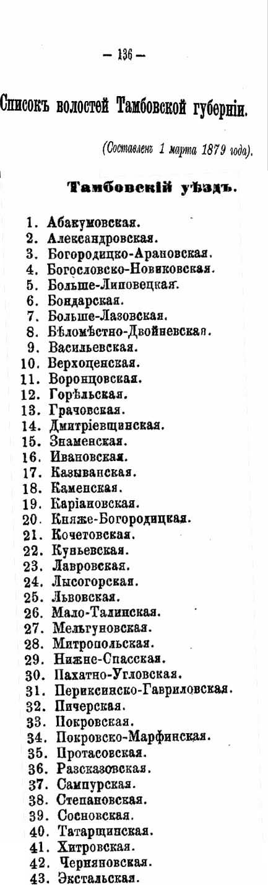

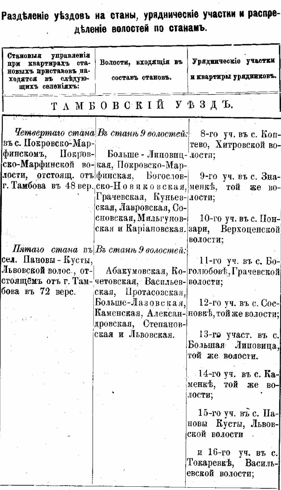

Вот сведения о Сосновке и окресностям  по данным 1862 года:22

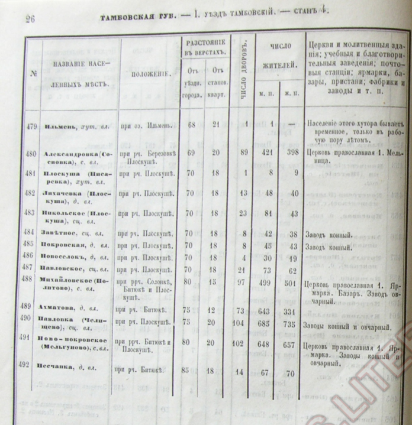

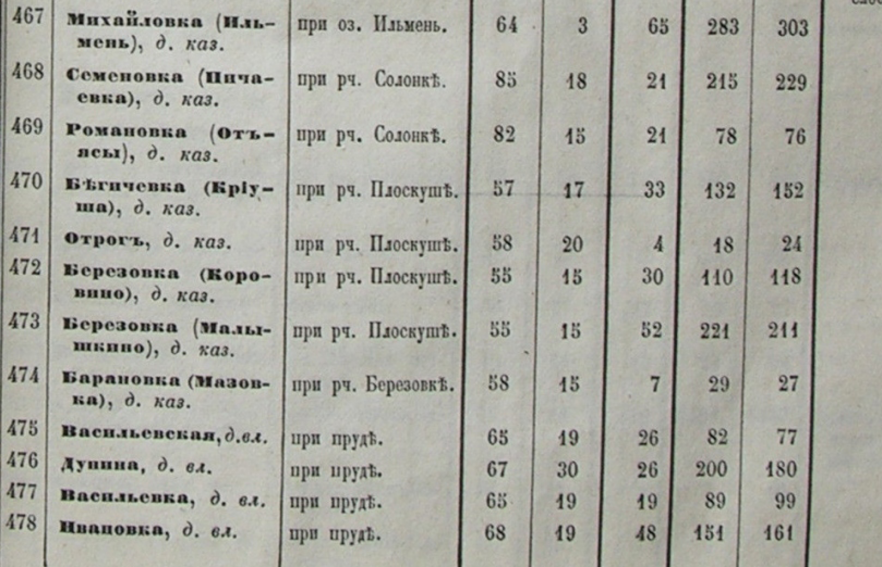

Александровка (Сосновка) – село владельческое, от уездного города- 69 км, от станового-20, при речках Березовке, Пласкуше, 89 дворов, 421 душ мужского и 398 женского пола. Церковь православная, мельница.

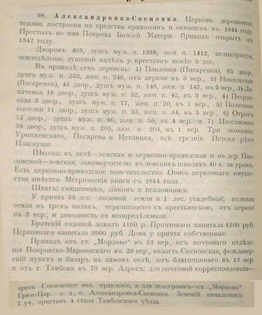

Вот так характеризовалось наше село в 1911 году. Как видите, появились новые землевладельцы- Истомины. 22

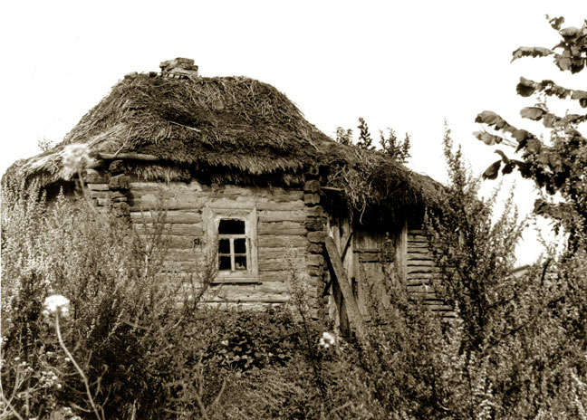

Семен Истомин держал небольшой конезавод в Мельгунах, возможно, это тот же господин. А вот двое других землевладельцев внесены в списки дворян Тамбовской губернии. 

